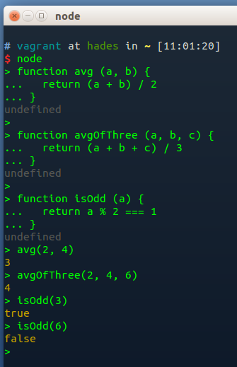

Wow! Looking great. Looks like you really understand colors. Nice work.

On the HTML, please try to format it nicely. Later you'll mostly be generating it from code, and it will end up kind of messy, but for this part of the course where we're writing it by hand, it's good to practice attention to detail and good style.

Instead of using word wrap, it's best to wrap lines to 80 characters. You can set atom to put a line at 80 characters so you can see when you approach it. It's true that sometimes in HTML in particular you can't avoid longer lines, but with JavaScript you should try to keep that 80 character line as a hard and fast rule.

So instead of this:

```html
<article>
   <h2>Article</h2>
   <p> The HTML Article Element(article) represents a self-contained composition in a   document, page, application, or site, which is intended to be independently distributable or reusable (e.g., in syndication). This could be a forum post, a magazine or newspaper article, a blog entry, an object, or any other independent item of content. Each (article) should be identified, typically by including a heading (h1-h6 element) as a child of the (article) element. </p>
   <p><i><small>Content categories: Flow content, sectioning, palpable content</small></i></p>
</article>
```

Try this:

```html
<article>
   <h2>Article</h2>

   <p>
    The HTML Article Element(article) represents a self-contained composition in
    a document, page, application, or site, which is intended to be
    independently distributable or reusable (e.g., in syndication). This could
    be a forum post, a magazine or newspaper article, a blog entry, an object,
    or any other independent item of content. Each (article) should be
    identified, typically by including a heading (h1-h6 element) as a child of
    the (article) element.
  </p>

  <p class="content-categories">
    Content categories: Flow content, sectioning, palpable content
  </p>
</article>
```

It's a bad practice, generally, to use `<i>` for italics. That's left over from the bad old days when we used HTML for styling. Ditto for `<small>`, unless by `<small>` you mean "fine print". The right way to apply a style is with CSS. We should use a `class` as we're probably going to be applying these same styles on multiple pages. And that `class` should have a name that gives us some semantic information. So here I've called it "content-categories" (please use `train-case` for IDs and classes in CSS).

Now we can add our styles:

```html
<style type="text/css" media="all">
  .content-categories {
    font-size: 80%;
    font-style: italic;
  }
</style>
```

See how that works? Try adding that `<style>` element to your page's `<head>` element and see if it works. (You'll need to change the other HTML as well, of course.)

In your `s2.js` file you have a fundamental misunderstanding that we should nip in the bud. When a function encounters the `return` keyword, it immediately returns a value and ends processing of the function call. So if you have code like this:

```js
function avg(a, b) {
  return (a + b) / 2;
  return avg
}
```

That second return&mdash;`return avg`&mdash;is never going to run. Neither do we need it. The first `return` will return the result of adding `a` to `b` and then diving the sum by `2`, which is the average we're after.

Another thing you should be aware of is that you only have to *declare* a variable once in the scope in which it is used. So once you've declared `var a = 2` at the top of the file, afterward, you can reset it without the `var` keyword, like this: `a = 2`. And there is no point in doing that because it is already set to 2, right?

So I see a misunderstanding about scope here. Let's clear that up.

First, when you *define* a function like this:

```js
function avg (a, b) {
  return (a + b) / 2
}

```

You are *creating* variables called `a` and `b` *inside the function scope. These will be set to actual values when you *call* the function, like this:

```js
avg(2, 4) // returns 3
```

The `a` and `b` you set *outside* the function definition are *irrelevant* to the `a` and `b` *inside* the function, because setting your parameters to `a` and `b` *overrides* any global variables with that name.

Please reread the section on scope and ask me questions on Slack if you're still confused by this.

> Note: Ha, ha. I just realized that I wrote the below note forgetting that I'd asked you to return 1 or 0, so your function is correct (except for the `return isOdd` bit). I did that to make it easier. In reality, a function like `isOdd` would be expected to return a boolean value (true or false), so the way I describe below is more realistic. Not that you'll spend much time writing function to check if a number is odd! :-)

Also, your `isOdd` function returns the *remainder* of `a` (whatever `a` is) modulus 2, which will be 1 or 0. Although 1 and 0 are what we call "truthy" and "falsie" values in JavaScript (1 will be treated as true and 0 as false), we should not rely on that. Better to do a comparison with what we want using the `===` comparison operator (which returns `true` if the two things are exactly equal and `false` if they're not).

If a number is odd then we'll get a remainder of 1 when we do modulus 2, so this will test for an odd number: `a % 2 === 1`.

Here is your `s2.js` file rewritten:

```js
function avg (a, b) {
  return (a + b) / 2
}

function avgOfThree (a, b, c) {
  return (a + b + c) / 3
}

function isOdd (a) {
  return a % 2 === 1
}
```

Try running those in the node REPL. If you are confused by that, contact me via Slack and I'll help you with it. Here's what it should look like:



The code in your `s2.js` file will not run, so I am guessing that you didn't run it in the REPL. You *must* run the code to make sure it works.

Remember the difference between *defining* a function and then using it (*calling* it). We define a function like this:

```js
function avg (a, b) {
  return (a + b) / 2
}
```

Note the use of spaces! That's our preferred style for phase 0. We can call the above function like this:

```js
avg(5, 7)
```

Note that there is no space between the `avg` and the `(`. This is not accidental! Also, note that we have no semicolons. This is also not accidental. This is the hard part of learning to code: *attention to detail*. Be sure to look carefully at not only the content, but the *style* of how we're doing things. That's important.

Outstanding work on the accessibility, usability, and design stuff. Looks like JavaScript is where you'll need the most help. Don't let the other stuff slide (you're doing so well!), but let's focus on getting the fundamental ideas of programming and JavaScript down ASAP. Please feel free to Slack questions to the group or to me personally. We'll get you answers.

I know that when you first start out you often don't know what you don't know, so don't worry. We'll keep at this until you're a real pro.

